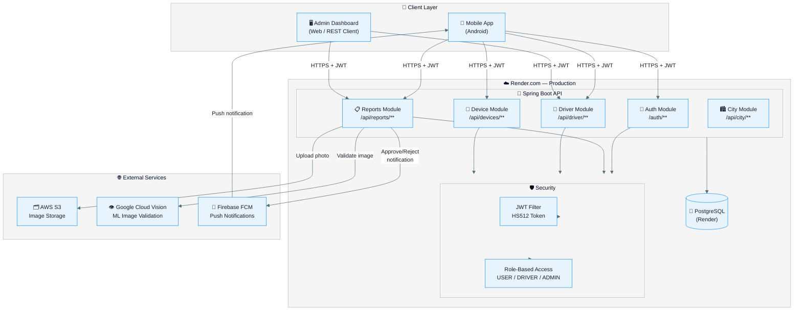

# System Architecture Diagram

> High-level view of all CleanCity system components and how they communicate.

---



---

## Component Descriptions

| Component | Technology | Purpose |
|-----------|-----------|---------|
| **Mobile App** | Android | Users submit complaints, drivers view/complete tasks |
| **Admin Dashboard** | REST Client / Web | Admins manage reports, drivers, approvals |
| **Spring Boot API** | Java 17, Spring Boot 3 | Central backend REST API |
| **JWT Filter** | JJWT / HS512 | Validates Bearer tokens on every request |
| **RBAC** | Spring Security `@PreAuthorize` | Enforces USER / DRIVER / ADMIN access |
| **PostgreSQL** | Render Managed DB | All persistent data (accounts, reports, etc.) |
| **AWS S3** | AWS SDK v2 | Stores complaint and completion photos |
| **Google Cloud Vision** | Vision API v1 | ML validation — confirms image contains waste |
| **Firebase FCM** | Firebase Admin SDK | Push notifications on approve/reject |

---

## Data Flow Summary

```
User submits photo → S3 (stored) → Cloud Vision (validated)
                  → PostgreSQL (saved as PENDING)

Admin assigns driver → PostgreSQL (status: ASSIGNED)

Driver completes task → S3 (completion photo) → PostgreSQL (status: AWAITING_REVIEW)

Admin approves → PostgreSQL (status: APPROVED) → FCM → User's phone notification
```

---

[← Back to Diagrams Index](./README.md)
