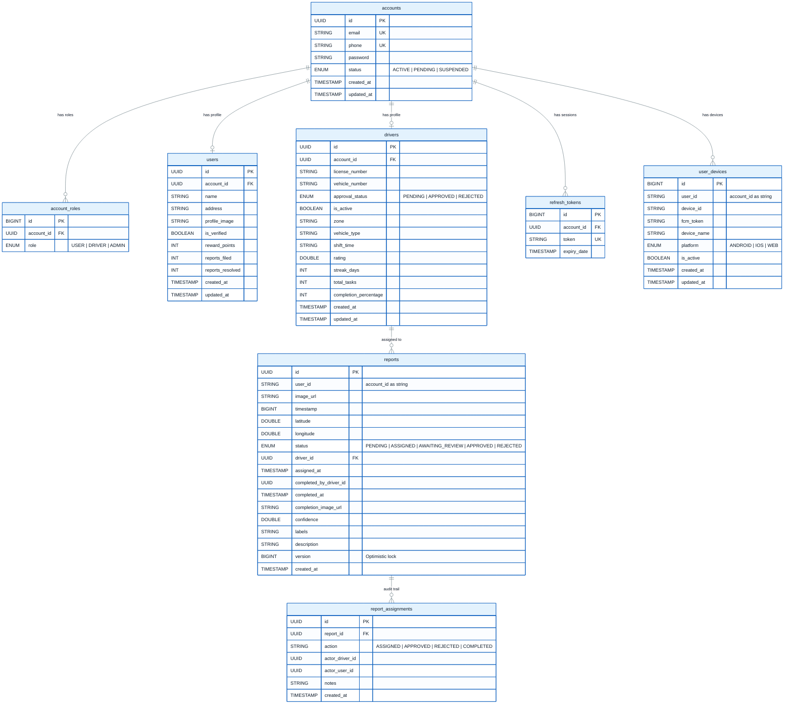

# Database ER Diagram

> All PostgreSQL tables, columns, data types, and relationships.

---

---

## Table Descriptions

### `accounts` — Authentication & Identity
Central login table. Every human actor (user, driver, admin) has exactly one account.

### `account_roles` — Role Assignments
Many-to-many bridge between accounts and roles. A single account can have multiple roles (e.g. `USER` + `DRIVER`).

### `users` — Citizen Profile
Stores public-facing citizen data: name, address, reward points, report stats. Linked 1-to-1 with `accounts`.

### `drivers` — Sanitation Driver Profile
Driver-specific data: vehicle info, zone, rating, task completion metrics. Linked 1-to-1 with `accounts`.

### `refresh_tokens` — Session Management
JWT refresh tokens. Each login session gets one token; logout deletes it.

### `user_devices` — FCM Push Targets
Stores Firebase Cloud Messaging tokens registered by the mobile app. Used to send push notifications.

### `reports` — Complaint Reports
Core table. Each row is one complaint submitted by a citizen. Tracks full lifecycle from `PENDING` to `APPROVED`/`REJECTED`.

### `report_assignments` — Audit Trail
Immutable log of every action taken on a report (assign, approve, reject, complete). Used for accountability.

---

## Key Relationships

| Relationship | Type | Details |
|-------------|------|---------|
| account → account_roles | One-to-Many | One account can have multiple roles |
| account → users | One-to-One | Each citizen account has one profile |
| account → drivers | One-to-One | Each driver account has one profile |
| account → refresh_tokens | One-to-Many | Multiple active sessions allowed |
| account → user_devices | One-to-Many | Multiple devices per user |
| driver → reports | One-to-Many | One driver can be assigned many reports |
| report → report_assignments | One-to-Many | Full audit trail per report |

---

[← Back to Diagrams Index](./README.md)
