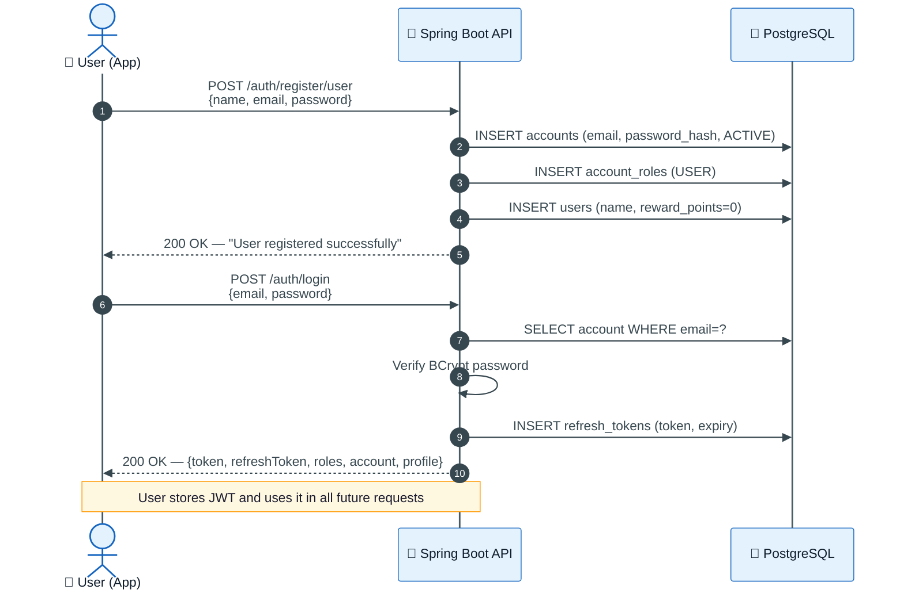
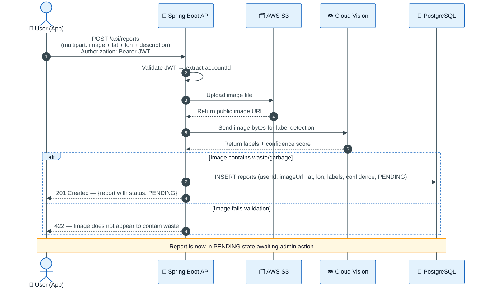
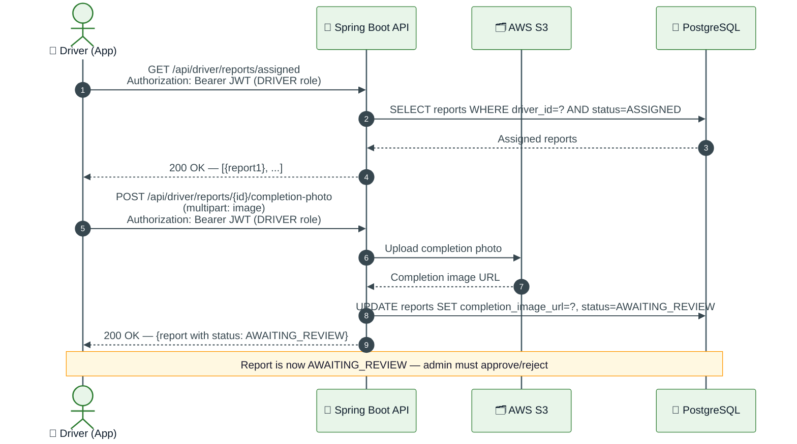
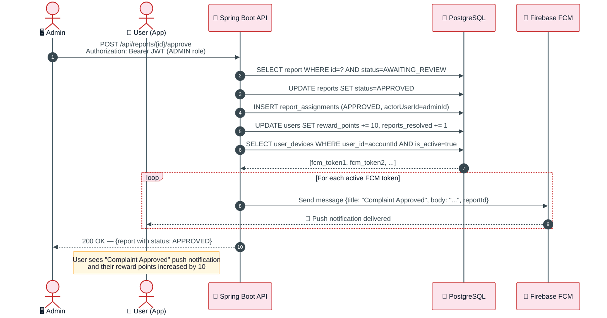
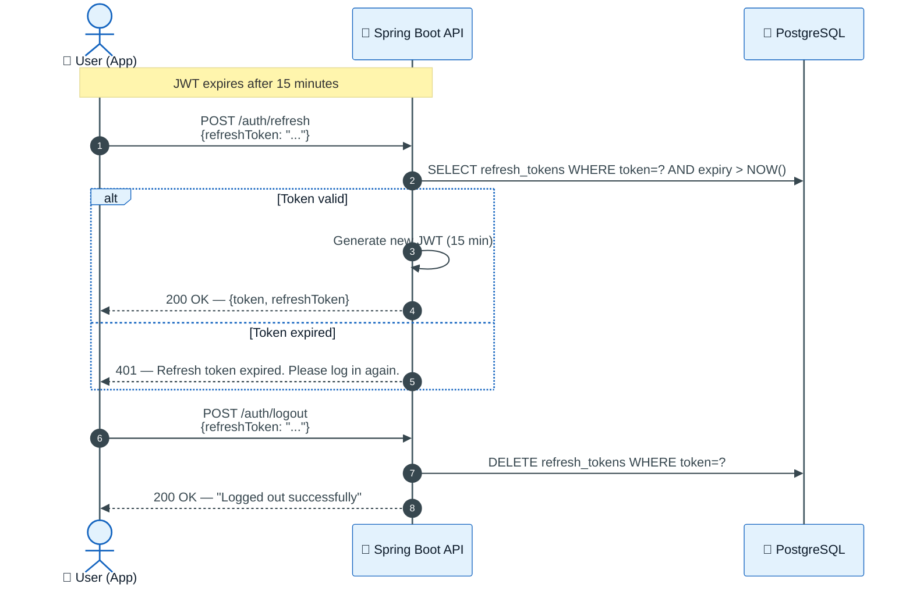

# Sequence Diagram — Full Complaint Lifecycle

> End-to-end flow from a citizen submitting a complaint to receiving a push notification when it's resolved.

---

## 1. User Registration & Login



---

## 2. Complaint Submission & AI Validation



---

## 3. Admin Reviews & Assigns Driver

```mermaid
%%{init: {
  "theme": "base",
  "themeVariables": {
    "background": "#ffffff",
    "primaryColor": "#fce4ec",
    "primaryBorderColor": "#c62828",
    "primaryTextColor": "#1a1a2e",
    "actorBkg": "#fce4ec",
    "actorBorder": "#c62828",
    "actorTextColor": "#0d1b2a",
    "actorLineColor": "#455a64",
    "signalColor": "#37474f",
    "signalTextColor": "#37474f",
    "noteBorderColor": "#ff9800",
    "noteBkgColor": "#fff8e1",
    "noteTextColor": "#1a1a2e",
    "fontFamily": "Segoe UI, Arial, sans-serif",
    "fontSize": "13px"
  }
}}%%

sequenceDiagram
    autonumber
    actor A as 🖥️ Admin
    participant API as 🌿 Spring Boot API
    participant DB as 🐘 PostgreSQL

    A->>API: GET /api/reports?status=PENDING<br/>Authorization: Bearer JWT (ADMIN role)
    API->>DB: SELECT reports WHERE status=PENDING
    DB-->>API: List of pending reports
    API-->>A: 200 OK — [{report1}, {report2}, ...]

    A->>API: GET /api/driver/active<br/>Authorization: Bearer JWT (ADMIN role)
    API->>DB: SELECT drivers WHERE is_active=true AND approval_status=APPROVED
    DB-->>API: List of active drivers
    API-->>A: 200 OK — [{driver1}, {driver2}, ...]

    A->>API: POST /api/driver/reports/{reportId}/assign<br/>{driverId: "uuid"}<br/>Authorization: Bearer JWT (ADMIN role)
    API->>DB: UPDATE reports SET status=ASSIGNED, driver_id=? WHERE id=? AND status=PENDING
    API->>DB: INSERT report_assignments (ASSIGNED, actorUserId=adminId)
    DB-->>API: Updated report
    API-->>A: 200 OK — {report with status: ASSIGNED}

    Note over A,DB: Driver is now assigned; report status = ASSIGNED
```

---

## 4. Driver Completes the Task



---

## 5. Admin Approves → User Receives Push Notification



---

## 6. Token Refresh & Logout



---

[← Back to Diagrams Index](./README.md)
