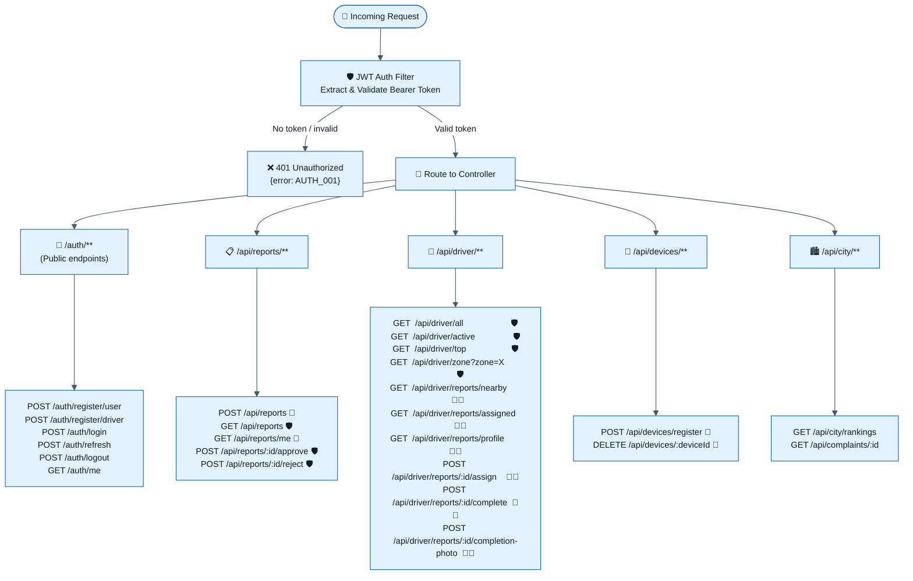
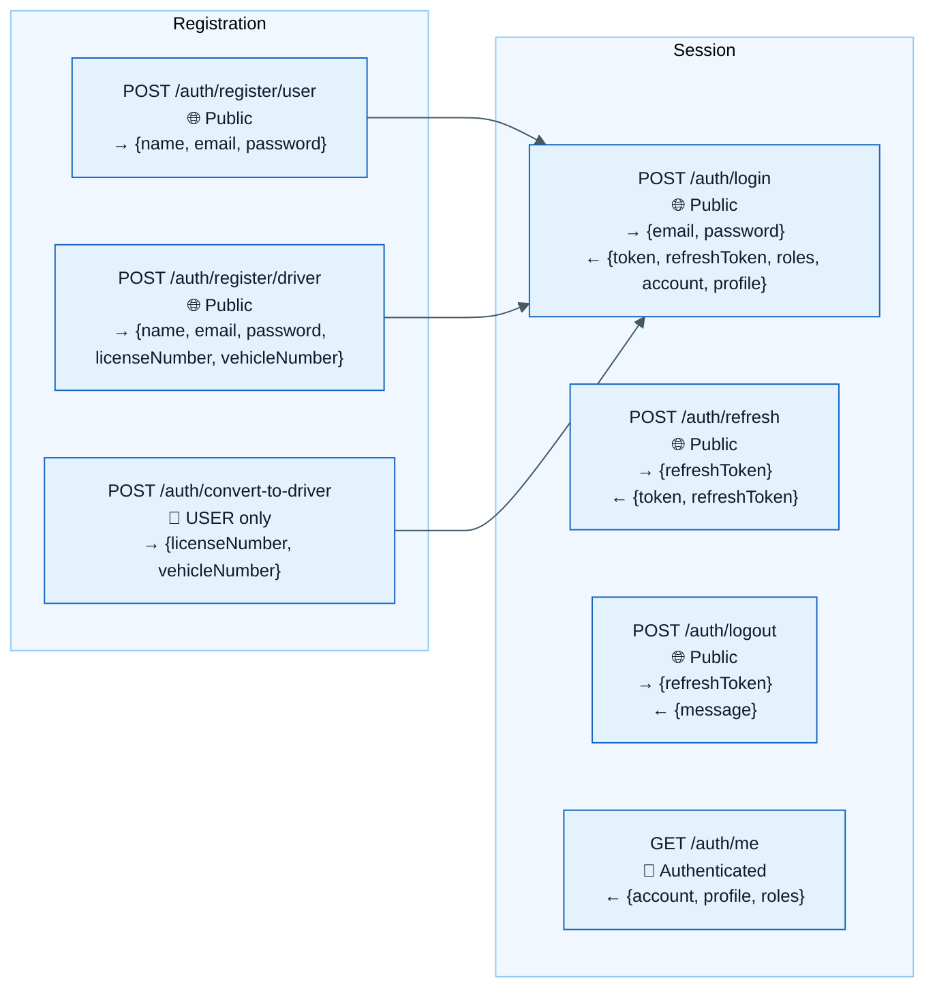
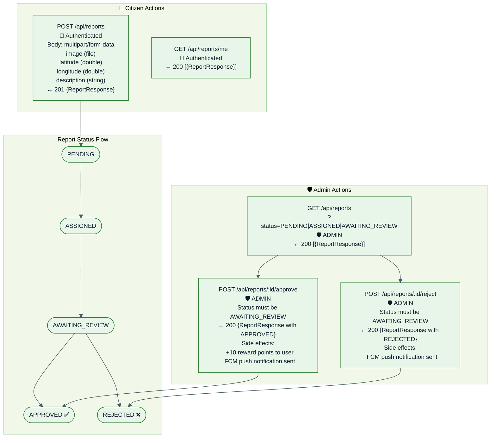
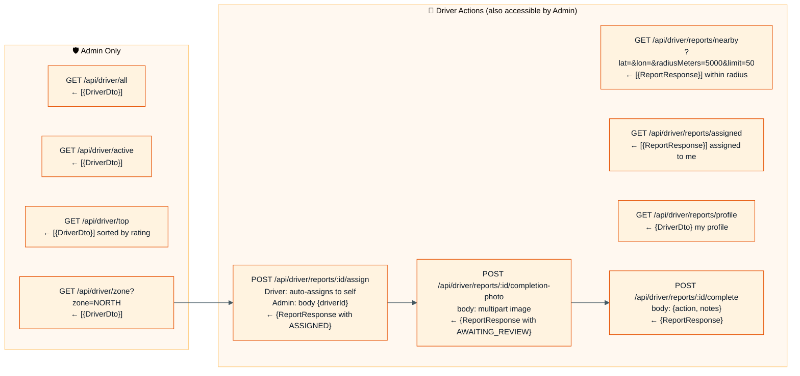
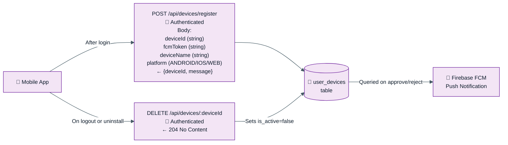

# API Request-Response Flow Diagram

> All REST API endpoints, access control, and response shapes grouped by module.

---

## Access Control Legend

| Symbol | Meaning |
|--------|---------|
| 🌐 | Public — no authentication required |
| 🔑 | Authenticated — any valid JWT |
| 👤 | USER role required |
| 🚛 | DRIVER role required |
| 🛡️ | ADMIN role required |
| 🔑🚛 | DRIVER or ADMIN |

---

## API Overview Flow



---

## Auth Endpoints — `/auth/**`



---

## Report Endpoints — `/api/reports/**`



---

## Driver Endpoints — `/api/driver/**`



---

## Device & Notification Endpoints — `/api/devices/**`



---

## Error Response Format

All errors return a consistent JSON structure:

Standard error body:

```json
{
  "isSuccess": false,
  "status": 404,
  "errorCode": "REPORT_001",
  "error": "Report Not Found",
  "message": "No report was found for the given ID.",
  "timestamp": "2026-08-11T12:10:00.123Z",
  "path": "/api/reports/..."
}
```

| Error Code | HTTP | Title | Message |
|-----------|------|-------|---------|
| `AUTH_001` | 401 | Unauthorized | Authentication is required. Please sign in and send a valid Bearer token. |
| `AUTH_002` | 401 | Invalid Credentials | The email or password you entered is incorrect. Please try again. |
| `AUTH_003` | 403 | Access Denied | You do not have permission to perform this action. |
| `AUTH_004` | 401 | Invalid Refresh Token | The refresh token is invalid or has already been used. Please sign in again. |
| `AUTH_005` | 401 | Refresh Token Expired | Your session has expired. Please sign in again. |
| `AUTH_006` | 409 | Email Already Registered | An account with this email already exists. |
| `AUTH_007` | 409 | Phone Already Registered | An account with this phone number already exists. |
| `AUTH_008` | 403 | Account Inactive | This account is inactive, suspended, or pending activation. |
| `REPORT_001` | 404 | Report Not Found | No report was found for the given ID. |
| `REPORT_003` | 409 | Report Not Awaiting Review | Report is not awaiting admin review. |
| `DRIVER_001` | 404 | Driver Not Found | No driver profile was found for this account. |
| `DRIVER_003` | 400 | Driver ID Required | Admin assignment requires a driverId in the request body. |
| `DRIVER_004` | 403 | Driver Cannot Approve | Drivers cannot approve reports. |
| `VALID_001` | 400 | Validation Failed | One or more request fields are invalid. |
| `SYS_001` | 500 | Internal Server Error | Something went wrong on our side. |

---

[← Back to Diagrams Index](./README.md)
