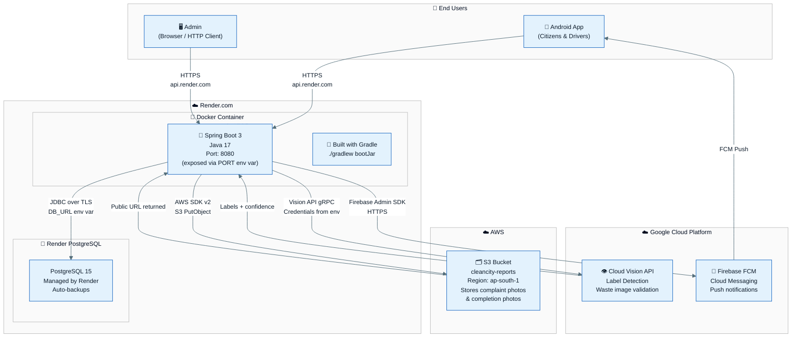
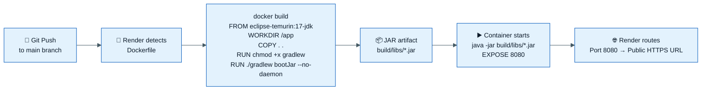
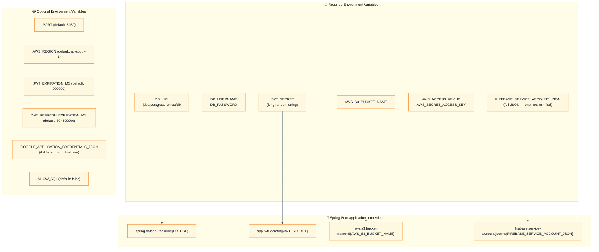
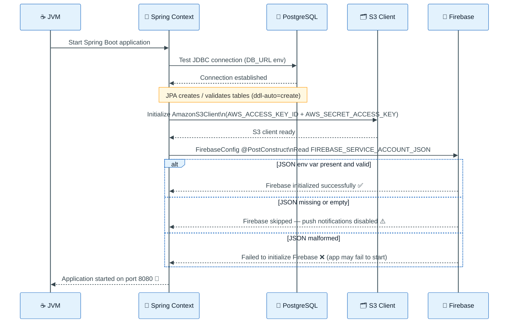

# Deployment Diagram

> How CleanCity Backend is deployed across Render, AWS, Google Cloud, and Firebase.

---

## Infrastructure Overview

---

## Docker Build & Run Flow

---

## Environment Variables on Render

---

## Production URL & Endpoints

| Resource | Value |
|----------|-------|
| **Base URL** | `https://cleancity-backend-au86.onrender.com` |
| **Health** | `GET /` (Spring Boot default) |
| **Auth** | `/auth/login`, `/auth/register/user`, `/auth/register/driver` |
| **Reports** | `/api/reports` |
| **Drivers** | `/api/driver/all` |
| **Devices** | `/api/devices/register` |

---

## Startup & Initialization Sequence

---

## Cost & Scaling Notes

| Service | Plan | Notes |
|---------|------|-------|
| Render Web Service | Free / Starter | Spins down after 15 min inactivity on free tier |
| Render PostgreSQL | Free | 90-day expiry on free tier; upgrade for production |
| AWS S3 | Pay-as-you-go | Very low cost for image storage |
| Google Cloud Vision | Free tier | 1,000 units/month free |
| Firebase FCM | Free | No cost for push notifications |

> **Note:** On Render's free tier, the first request after idle may take 30–60 seconds (cold start). Upgrade to a paid plan for always-on service.

---

[← Back to Diagrams Index](./README.md)
